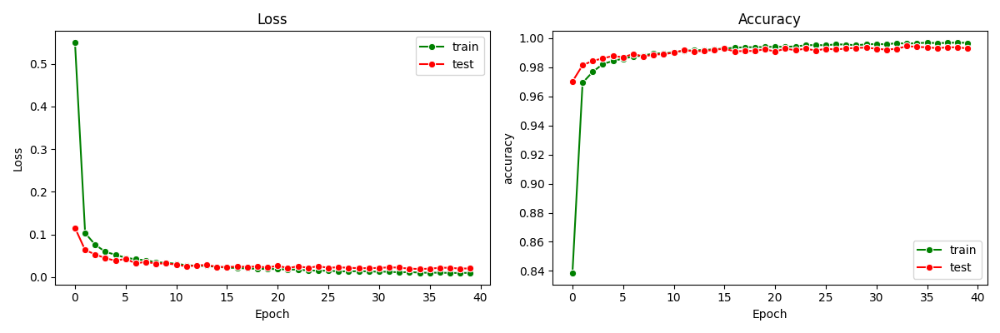

Assignment

(1)  
a. The number of model parameters of LeNet-5 and your custom MLP

    LeNet5 total_params : 61,706 
    ----------------------------------------------------------------
            Layer (type)               Output Shape         Param #
    ================================================================
                Conv2d-1            [-1, 6, 28, 28]             156
                  ReLU-2            [-1, 6, 28, 28]               0
            MaxPool2d-3            [-1, 6, 14, 14]               0
                Conv2d-4           [-1, 16, 10, 10]           2,416
                  ReLU-5           [-1, 16, 10, 10]               0
            MaxPool2d-6             [-1, 16, 5, 5]               0
                Linear-7                  [-1, 120]          48,120
                  ReLU-8                  [-1, 120]               0
                Linear-9                   [-1, 84]          10,164
                ReLU-10                   [-1, 84]               0
              Linear-11                   [-1, 10]             850
    ================================================================
    Total params: 61,706
    Trainable params: 61,706
        
    CustomMLP total_params : 61,737
    ----------------------------------------------------------------
            Layer (type)               Output Shape         Param #
    ================================================================
                Linear-1                   [-1, 58]          59,450
                  ReLU-2                   [-1, 58]               0
                Linear-3                   [-1, 33]           1,947
                  ReLU-4                   [-1, 33]               0
                Linear-5                   [-1, 10]             340
    ================================================================
    Total params: 61,737
    Trainable params: 61,737

    - Both models(LeNet5, CustomMLP) have a similar number of parameters

b. How to compute model parameters

  - total_params = sum(p.numel() for p in model.parameters())
    
    print(total_params)
    
    * Tensor.numel() : Returns the total number of elements

  - (+) library : torchsummary.summary > summary(model,(input.shape))

(2) 
Plot statistics (average loss value and accuracy) for training and testing.

  - (Setting) train Epochs : 40, batch size = 256

  - LeNet5 statistics
    

  - Custom MLP statistics
    

    - Both models show continuous improvement in training loss and accuracy over time,
      but the test loss and accuracy improve in the beginning, and then converge to a specific value.

(3) 
Comparing the predictive performances

  - LeNet5      : (Test accuracy) 0.990
  - CustomMLP   : (Test accuracy) 0.978
    - LeNet5 shows higher performances than CustomMLP

(4) 
Employ at least more than two regularization techniques to improve LeNet5 model

  - Three regularization techniques
    
      a. Dropout
      b. BatchNormalization

  - (Test accuracy) 0.993, improvements: +0.003

  - (statistics of LeNet5 applying two regularization techniques)
    

    - The results show that two regularization techniques help prevent overfitting and improve performance.
